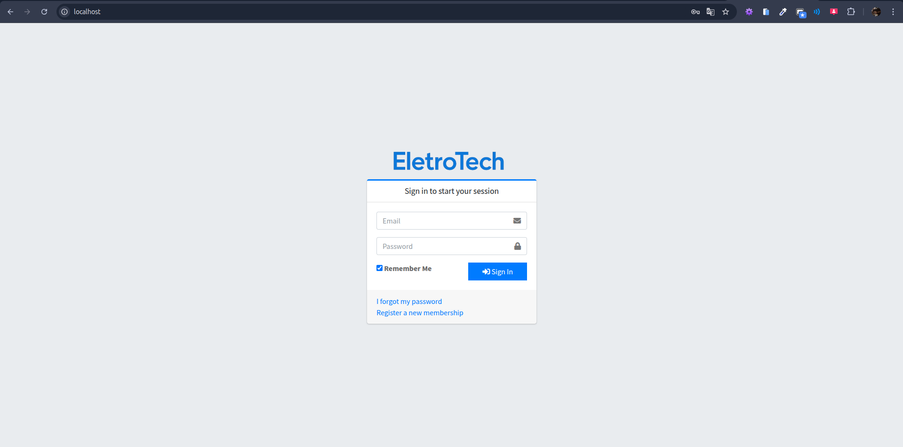
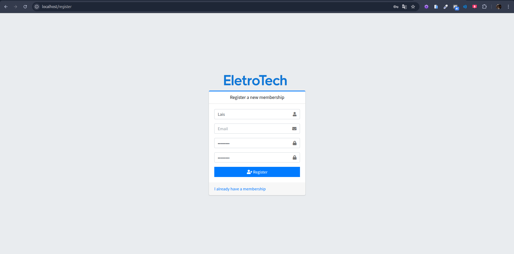
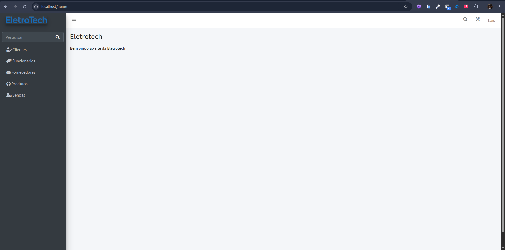
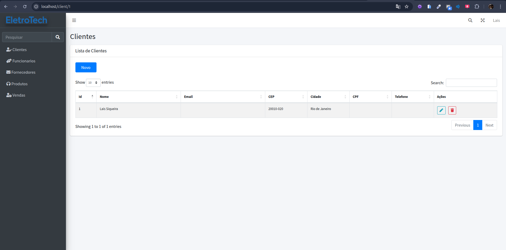
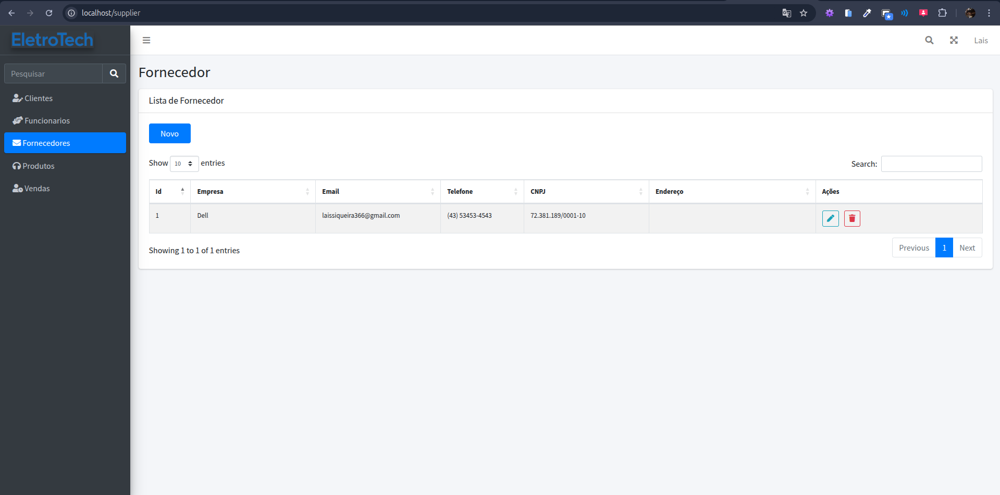
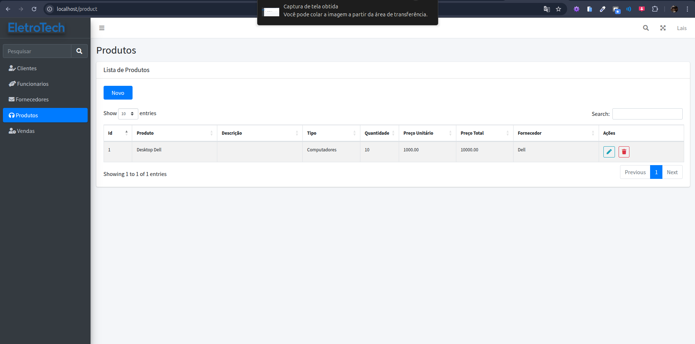
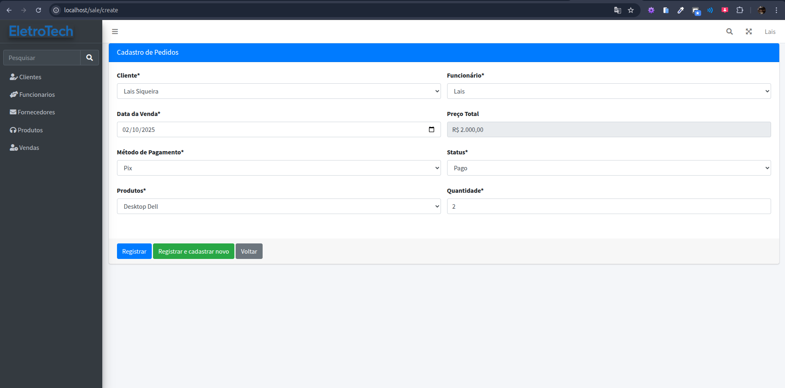
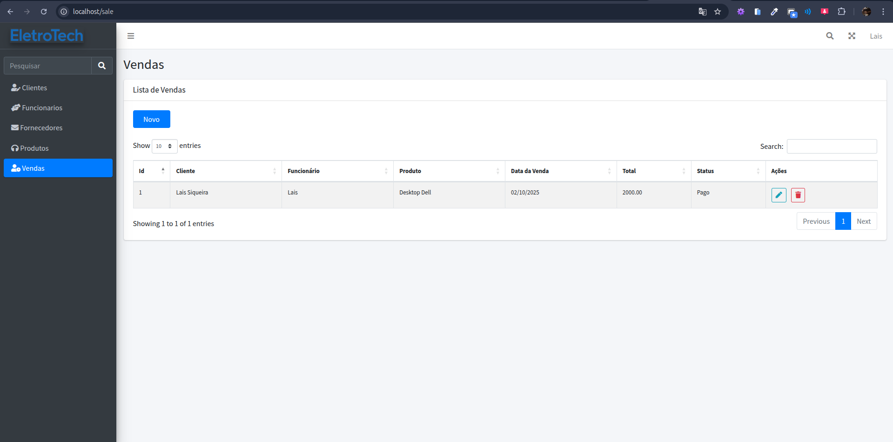

# 🛒 Loja Eletrônicos

> Trabalho desenvolvido para o curso do **Senai**, utilizando **Laravel + Docker**.  

---
## 📸 Preview










## ⚡ Pré-requisitos

Antes de começar, você precisa ter o **Docker** instalado no seu computador.

- 🔗 [Instalar Docker no Windows](https://docs.docker.com/desktop/install/windows-install/)  
- 🔗 Para Ubuntu/Linux:

```bash
sudo apt update
sudo apt install docker.io docker-compose -y
```

Verifique se o Docker está funcionando:

```bash
docker --version
docker-compose --version
```

## 🚀 Como rodar o projeto

## ATENÇÃO

Os arquivos q estão como .env.example vcs vão renomear para apenas .env 

## 1️⃣ Construir e subir os containers
Na raiz do projeto, rode:
```bash
docker-compose up -d --build
```
## 2️⃣ Acessar o container da aplicação
```bash
docker exec -it loja_eletronicos-app-1 bash
```
## 3️⃣ Instalar dependências
Dentro do container:

```bash
composer install
npm install
```
## 4️⃣ Rodar as migrations
Ainda dentro do container:

```bash
php artisan migrate
```